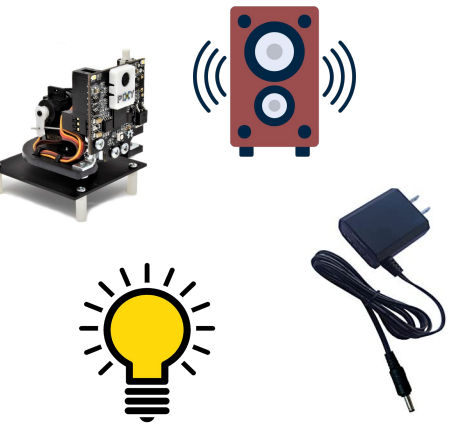
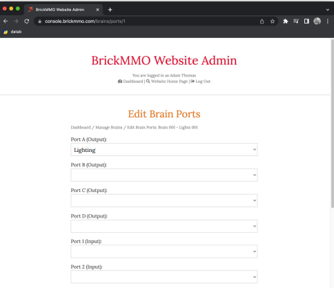
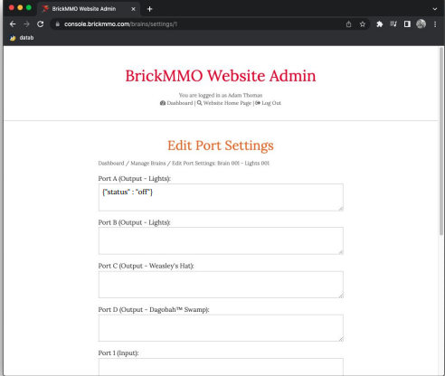
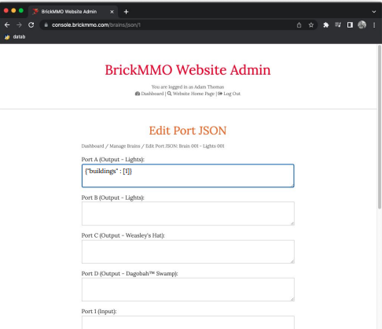
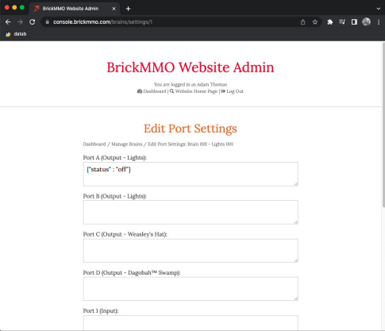
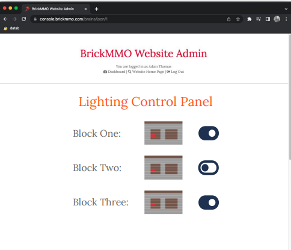

## Weather


### Description
---
Our plan is to add a weather system to Lego City. The weather system would include the addition of various seasons, sounds and lighting.

- Light will be dimmed/brightened and weather will be randomized in 4 hour intervals
- Snow plow trucks (when it is gloomy/winter)


- Leaf blower comes out for autumn


- Sound (speakers around the city)
    - birds chirping
    - rain falling
    - thunderstorm
    - wind

- Music (according to the season, the weather system will send a message to the radio system to play songs accordingly)

### Dependency
---
- Radio System (to play music according to seasons)
- A speaker system (different from radio) to play seasonal sounds (i.e birds chirping)
- Twitter API (daily weather reports)


### Requirements
---
This interaction will require 
- Lego Components
    - batteries 
    - sensors and motors 
    - EV3 hub 
    - lights
    - extensions.
- Non Lego Components
    - External speakers for seasonal sounds
    - External lighting to mimic day, night, gloomy weather etc.
    - Control of external speakers (external computer)





### Settings and Info
---
#### Module: Light
Can be connected to all the different light ports.
We will have external lighting around the perimeter of the city and street lights inside the city.



#### Module: Setting
Lights can be turned on and off.



#### Module: JSON
Additional information will include how long the light has been on for



#### Module: Speaker
External speakers will be connected to ports


#### Module: Settings-speaker
Speakers can be turned on, off. 



#### Admin Conrtrol Panel
Admin will have a control panel to change the status of the lights. You will be able to turn the light on or off.




## Pseudocode

IOT loop to turn lights on and of:

```pseudocode
While True
If (timeInterval >= 0 && timeInterval <= 4){
 streetLights = off;
adjustAdaptiveLights(timeInterval)
} else if(timeInterval >= 5 && timeInterval <= 8){
adjustAdaptiveLights(timeInterval)
Streetlight = on
}

```

IOT loop for seasons

``` pseudocode

Function SetSeason () {
Set Season = random number (1-4)
If Season == 1 { 
 PlayRainSound(), SendSignal()}
Else If Season == 2 { PlayBirdSound(), 
SendSignal}
Else if Season == 3 { PlayLeavesSound(), 
SendSignal }
Else if Season == 4 { 
PlaySnowPlowerSound(), SendSignal }
}

```
API Endpoints

``` pseudocode

/api/season
Will return a season name
/api/time
Will return a time interval

```

[&#10132; Back to Hackathon](/hackathon-system)

---

<a href="https://brickmmo.com">

</a>
