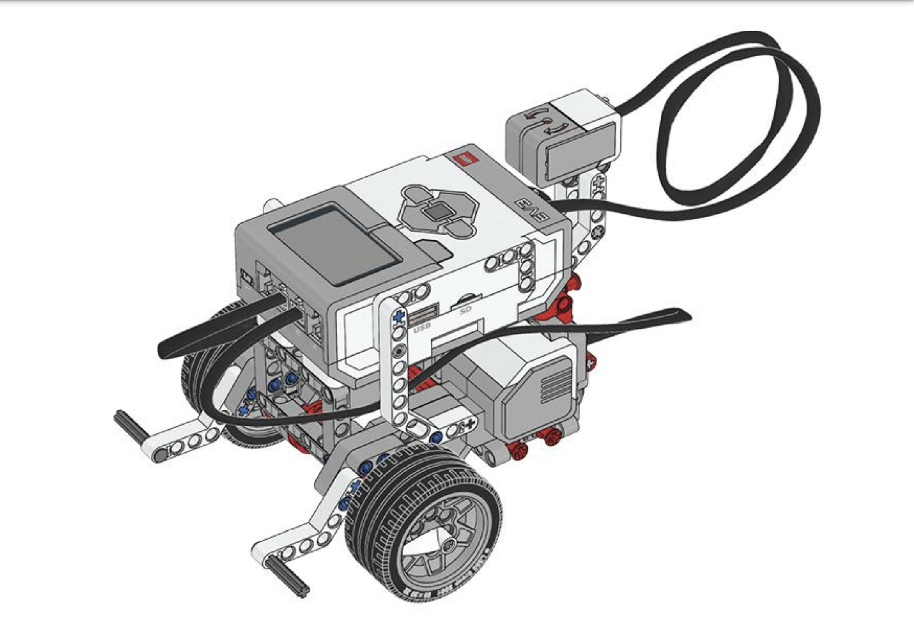

## Autonomous Driving Cars



> <small>Lego MINDSTORMS ev3 education 45544 instructions. (2013, October 1). Robotsquare – Robots, Tutorials, Engineering.
[https://robotsquare.com/2013/10/01/education-ev3-45544-instruction/](https://robotsquare.com/2013/10/01/education-ev3-45544-instruction/)</small>

### Description

This will be a core system useable by
other systems in BrickMMO. This system
lets a user point a location to the vehicle,
then the vehicle will drive to that location
automatically.

### Dependency

_This system will be dependant on :_

- GPS System
- Charging system
- Speed-Control system

### Requirements

This interaction will only require a EV3 hubs, lights, and extensions:


### Settings & State

- _Vehicle ID_ : Unique ID for API calls
- _Vehicle state_ : On / Off
- _Destination_ : GPS Location
- _Route Traffic_ : Retrieve from GPS
- _Battery Level_ : 0 - 100%

### Module Input / Output

_Inputs_

- Destination : GPS Location

_Outputs_

- Shortest Path to Destination : Route
- Estimated time to Destination : Integer
- Has enough charge to reach Destination : Boolean

### Possible Integrations

This core system can possibly be
integrated into a future public transit
system, or ride share like Uber.

## Pseudocode

This pseudocode manages a charged car's navigation, signaling, and speed control, including actions for obstacles, traffic, empty roads, and the use of a charging station.

```pseudocode
REPEAT-EVERY 30 Seconds

    IF carCharged THEN

        SetCoordinates

        WHILE NOT ReachedToCoordinates

            IF Obstacle OR Traffic THEN

                Signal
                SlowDownOrStop

            ELSE IF EmptyRoad THEN

                MaintainSpeed

            ELSE

                UseChargingStation

            ENDIF

        ENDWHILE

    ENDIF

ENDREPEAT
```

### API Endpoints

/api/vehicle/info/{vehicle-id}

- Returns the vehicle information of the
  specified vehicle. E.g Battery
  Percentage, Estimated time to location,
  etc.

/api/vehicle/destination/[vehicle-id]/{gps-
location}/

- Tells the specified vehicle id to goto the
  specified location.

[&#10132; Back to Hackathon](/hackathon-system)

---

<a href="https://brickmmo.com">

</a>
